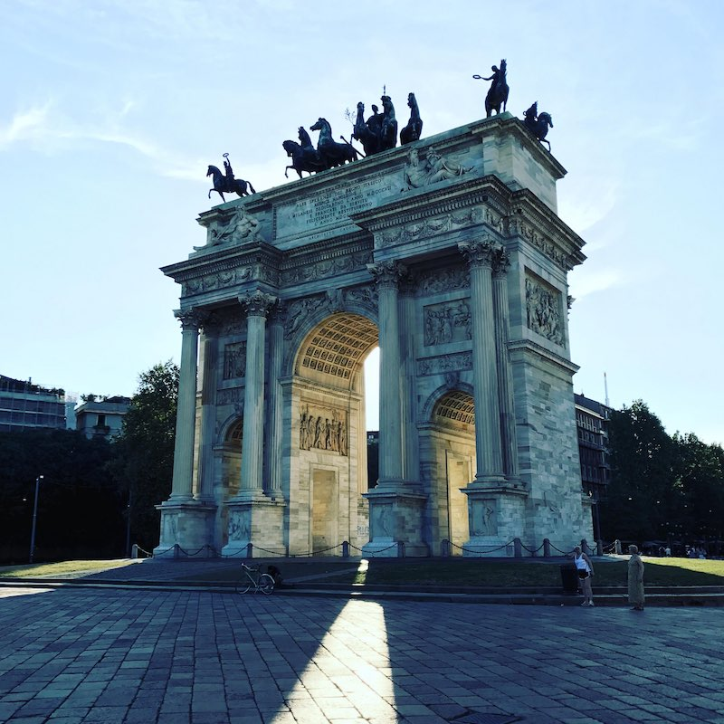

# Accurate Color Transformations Reconstruction

This repository includes tools which could be used for semi-automatically
and very accurate reconstruction of color filters used
in image processing software.
A vivid example of such filters is Instagram filters.

People like Instagram filters. They are trying to
[reproduce](https://github.com/girliemac/Filterous)
them [again](https://github.com/girliemac/filterous-2)
and [again](https://github.com/acoomans/instagram-filters).
And [again](https://github.com/lukexyz/CV-Instagram-Filters)
and [again](https://www.practicepython.org/blog/2016/12/20/instagram-filters-python.html).
And [again](https://code.tutsplus.com/tutorials/create-instagram-filters-with-php--net-24504)
and [again](https://picturepan2.github.io/instagram.css/).

The problem is most of this attempts based on manual color correction.
This is the only accurate reconstruction of color filters using a robust method.
For illustration, one of the following images obtained using Instagram filter
and second using applying accurate reconstruction.
Try to guess which one is which.

 

To compare, this is the result of applying **the same filter** from
a commercial set of Instagram-like filters.


[Source image](./static/source.jpg)

## How it works

This method based on [three-dimensional lookup tables][wiki-luts]
and their two-dimensional representation: [hald images][hald-image].
The idea is very simple: a sample hald image with uniform color distribution
is processed using target software with unknown color transformation algorithm.
After processing such hald image could be used as a filter
for a very accurate approximation for the target color transformation.

A resulting hald image could be used in various software such as
GraphicsMagick and Adobe Photoshop (with plugins) and converted to
3D LUT cube file format, which is common for a great number
of video editing software.

## Limitation

This method can restore color transformations only where
no other variables are used for manipulations.
For example, vignetting, scratches, gradients and watermarks can't be captured.
It also captures wrong if different filters are used for transformations
in different parts of an image.

## Requirements

To generate and process hald images you will need git
and a Python interpreter with pip.

```bash
$ git clone https://github.com/homm/color-transformations-reconstruction.git
$ cd color-transformations-reconstruction
$ pip install -r ./requirements.txt 
```

You can apply resulting hald images using GraphicsMagick.

## Guide

1. You need to create the identity image. For this simple run:

    ```bash
    $ ./bin/generate.py
    ```

    This will create `hald.5.png` file.
    The number in filename is square root of 3D table size.
    For example, 5 means 25×25×25 lookup table.

    

    This file doesn't look like any other hald images.
    This image is specially designed to resist any distortions
    which may occur during transformation, such as vignetting,
    scratches, gradients and JPEG artifacts.

2. Process the identity image with target software.
    Speaking of Instagram, you need to transfer identity image
    to the phone and post the image with one of the filters applied.
    After that, you'll see identity image with a filter in your camera roll.
    Then you need to transfer it back.

    

    Before continuing, make sure that identity image with a filter
    has exactly the same resolution as source identity image.

3. Convert identity image with a filter to the true hald image:

    ```bash
    $ ./bin/convert.py ./raw/1.Clarendon.jpg ./halds/
    ```

    Where `./halds/` is output folder.

    

4. That is it!
    Now you can apply resulting hald image to any other image.

    ```bash
    $ gm convert ./sample.jpg -hald-clut ./halds/1.Clarendon.png ./out.jpeg
    ```

     


  [wiki-luts]: https://en.wikipedia.org/wiki/3D_lookup_table
  [hald-image]: http://www.quelsolaar.com/technology/clut.html