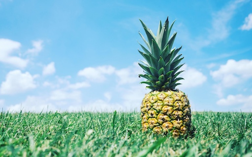
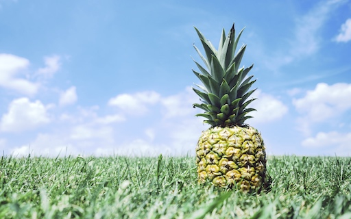
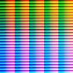
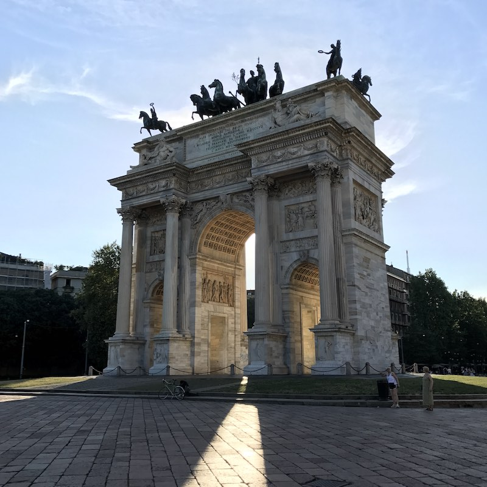
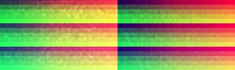

# Accurate Instagram Filters Reconstruction

There's a bunch of apps out there (e.g., Instagram) allowing you to apply color filters to images.
You might be interested in cloning their behavior: reconstruct them. This
repository holds tools for semi-automatically and very accurately reconstructing
color filters.

The truth is folks like Instagram filters. They are trying to
[reproduce](https://github.com/girliemac/Filterous)
them [again](https://github.com/girliemac/filterous-2)
and [again](https://github.com/acoomans/instagram-filters).
And [again](https://github.com/lukexyz/CV-Instagram-Filters)
and [again](https://www.practicepython.org/blog/2016/12/20/instagram-filters-python.html).
And [again](https://code.tutsplus.com/tutorials/create-instagram-filters-with-php--net-24504)
and [again](https://picturepan2.github.io/instagram.css/).
The problem with the attempts is they mostly deal with manually correcting
colors. For me, it was more interesting to find the solution using
more robust method and math.

This looks like the only attempt to the accurate reconstruction
of color filters.
For instance, one of the following images was obtained using Instagram filter,
and another using an accurate reconstruction. Try guessing which one was
reconstructed.

 

To compare, here is the result of applying **the same filter** from
a commercial set of Instagram-like filters.



[Source image](./static/source.jpg)


## How it works

This method provides an accurate color reconstruction, and is based on
[three-dimensional lookup tables][wiki-luts] and their two-dimensional
representation: [hald images][hald-image].
The core idea is simple: a sample hald image with a uniform color distribution
is processed using target color filter with an unknown transformation algorithm.
The processed hald image can then be used as a filter for a very accurate
approximation of that target color transformation.

A resulting hald image could then be used in various software such as
GraphicsMagick or Adobe Photoshop. You can use it in your iOS or macOS apps 
with [CocoaLUT][CocoaLUT]. Hald images could be converted to the
3D LUT cube file format, which is common in a great number of video editing
software.


## Limitation

This method can capture color transformations only where no other variables are
used for manipulations.
For example, vignetting, scratches, gradients, and watermarks can not be captured.
It also might be wrong when different filters are applied to different parts of
a single image.


## Requirements

To generate and convert hald images, you will need git and a pip-enabled Python
interpreter.

```bash
$ git clone https://github.com/homm/color-transformations-reconstruction.git
$ cd color-transformations-reconstruction
$ pip install -r requirements.txt 
```

The resulting hald images can be applied to any visuals in your application
using GraphicsMagick bindings for Python, Ruby, PHP, JavaScript™, and other
programming languages or using CLI. No software from this repository is required.


## Guide

1. First, you'll need to create the identity image. Just run:

    ```bash
    $ ./bin/generate.py
    ```

    This will create a file named `hald.5.png`.
    The number in the filename stands for the square root of a 3D LUT size.
    For example, `5` means we're dealing with a `25×25×25` lookup table.

    

    This file doesn't look like other hald images.
    This image is specifically designed to oppose distortions
    which may occur during transformations such as vignetting,
    scratches, gradients, and JPEG artifacts.

2. Process the identity image with a target software you prefer.
    Say, if you were using Instagram, you'd have to transfer the identity
    image to your device and post that image with one of the filters applied.
    After that, you'll see filtered identity image in your camera roll.
    Well, just transfer it back.

    

    Before continuing, make sure that the resolution of your filtered identity
    image exactly matches that of the source one.

3. Convert the filtered to the real hald image:

    ```bash
    $ ./bin/convert.py raw/1.Clarendon.jpg halds/
    ```

    Where `halds/` is your output directory.

    

4. That's it!
    You can now apply that resulting hald image to any input.

    ```bash
    $ gm convert sample.jpg -hald-clut halds/1.Clarendon.png out.jpeg
    ```

     


## Advanced tips

While the default parameters provide you with high-quality hald filters,
there are some cases where it is not enough.

If the target filter has heavy distortions on the local level or significant
gradients in the center of an image, some undesired effects may occur.
The most noticeable one is color banding. This is an original image and the one
processed with the Hudson-like filter, one of the most problematic in this aspect.

```bash
# Create hald image from processed by Instagram identity hald image
$ ./bin/convert.py raw/15.Hudson.jpg halds/
# Apply hald image to the sample image
$ gm convert girl.jpg -hald-clut halds/15.Hudson.png girl.15.jpg
```

 

You can notice that in the processed image many objects look flat and posterized:
face, hair, chairs in the background.
While posterization is one of the common image filters, it is not a part of the
Hudson filter.

If you thoroughly look at the
[image with a Hudson-like filter applied](./raw/15.Hudson.jpg),
you'll see that it looks noisy, and that's where the problem comes from.



Fortunately enough, you can ask `convert.py` to apply a gaussian blur to the
three-dimensional lookup table to reduce that noise. You'll need to install
[SciPy][scipy] to continue.

```bash
# The next line is only needed once
$ pip install scipy
$ ./bin/convert.py raw/15.Hudson.jpg halds/ --smooth 1.5
$ gm convert girl.jpg -hald-clut halds/15.Hudson.png girl.15.fixed.jpg
```

 

You can discover the additional `convert.py` options by executing
`./bin/convert.py --help`.

Have fun with reverse engineering!

[wiki-luts]: https://en.wikipedia.org/wiki/3D_lookup_table
[hald-image]: http://www.quelsolaar.com/technology/clut.html
[scipy]: https://www.scipy.org
[CocoaLUT]: http://cocoadocs.org/docsets/CocoaLUT/0.2.31/
